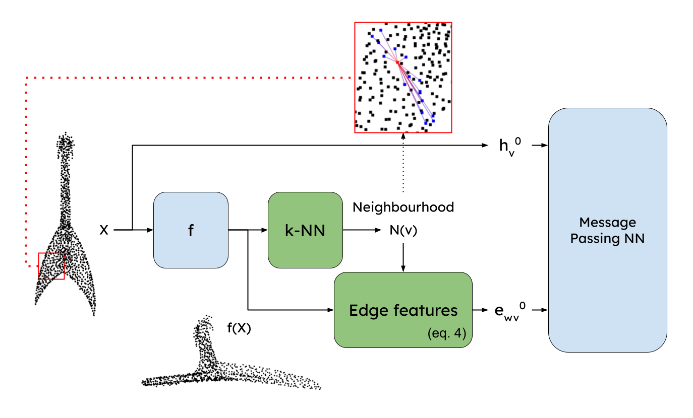

# Learning task-specific features for 3D pointcloud graph creation



In this work, we propose
a more principled way of creating a graph from a 3D pointcloud.
Our method is based on performing k-NN over a
transformation of the input 3D pointcloud. This transformation
is done by an MLP with learnable parameters that
is optimized through backpropagation jointly with the rest
of the network. We also introduce a regularization method
based on stress minimization, which allows to control how
distant is the learnt graph from our baseline: k-NN over
xyz space.

## Dependencies

[Python>=3.7](https://www.python.org/)

Install environment by running:

```
source deepgcn_env_install.sh
```

## How to train

We provide code to train over three different datasets: [ModelNet40](https://modelnet.cs.princeton.edu/), [ScanObjectNN](https://hkust-vgd.github.io/scanobjectnn/) and [S3DIS](http://buildingparser.stanford.edu/dataset.html).

In order to train our architecture on each one run:

### ModelNet40

```
python3 train_modelnet40.py
```

### ScanObjectNN

```
python3 train_scanobjectnn.py
```

### S3DIS

```
python3 train_S3DIS.py
```


### Acknowledgements
We borrow code from [Deep GCNs](https://github.com/lightaime/deep_gcns_torch).
